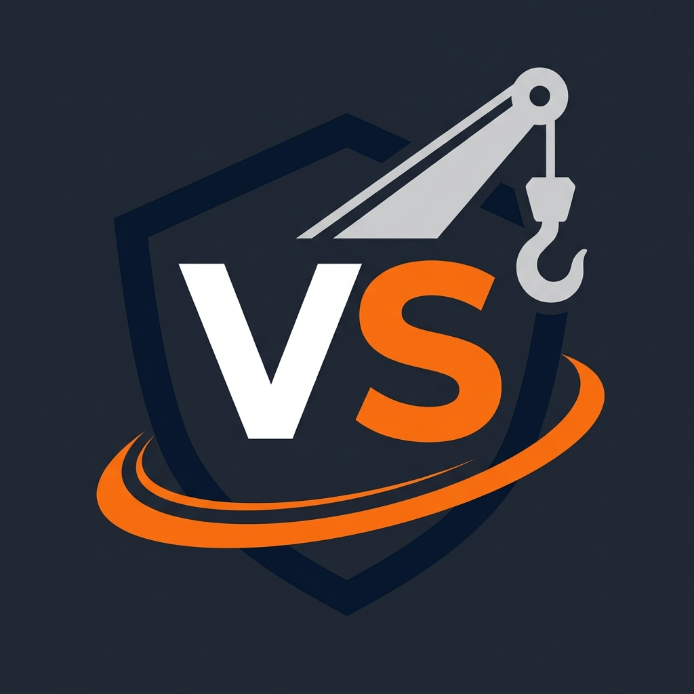

<h1 align="center">
  <br/>
  VS Reboque — Landing Page
</h1>

<p align="center">
  <strong>Landing page de alta performance para empresa de guincho e assistência veicular.</strong><br/>
  Next.js 16 · Tailwind CSS 4 · TypeScript · SSG (exportação estática)
</p>

<p align="center">
  
  
  
  
</p>

---

## 📋 Índice

- [Sobre o Projeto](#-sobre-o-projeto)
- [Stack Tecnológico](#-stack-tecnológico)
- [Estrutura de Arquivos](#-estrutura-de-arquivos)
- [Dados da Empresa](#-dados-da-empresa)
- [Desenvolvimento Local](#-desenvolvimento-local)
- [Build de Produção](#-build-de-produção)
- [Deploy no CloudPanel (VPS)](#-deploy-no-cloudpanel-vps)
- [Manutenção e Atualizações](#-manutenção-e-atualizações)
- [SEO e Schema Markup](#-seo-e-schema-markup)

---

## 🚛 Sobre o Projeto

Landing page **single-page** otimizada para conversão (CRO) e SEO local da empresa **VS Reboque**, especializada em guincho e assistência veicular em Teotônio Vilela - AL.

### Seções da página

| Seção | Descrição |
|-------|-----------|
| **Header fixo** | Logo + botão "Ligue Agora" com número principal |
| **Hero** | Título de emergência, slogan e 2 CTAs gigantes (WhatsApp e telefone) |
| **Serviços** | Grid de 8 cards com ícones Lucide React |
| **Confiança** | Stats da empresa + 4 diferenciais + CTA interno |
| **Footer** | Faixa CTA laranja + contatos + endereço + CNPJ |
| **FAB WhatsApp** | Botão flutuante fixo no canto inferior direito, visível em toda a rolagem |

---

## 🛠 Stack Tecnológico

| Tecnologia | Versão | Função |
|-----------|--------|--------|
| **Next.js** | 16.2.10 | Framework React com App Router |
| **React** | 19.2 | Biblioteca UI |
| **TypeScript** | 5 | Tipagem estática |
| **Tailwind CSS** | 4 | Estilização utility-first |
| **Lucide React** | 1.23 | Ícones SVG tree-shakeable |
| **next/font** | — | Inter (Google Fonts, zero FOUT) |

> **Modo de build:** `output: "export"` — gera arquivos HTML/CSS/JS estáticos na pasta `out/`. Não necessita de servidor Node.js em produção; pode ser servido por qualquer servidor web (Nginx, Apache, CDN).

---

## 📁 Estrutura de Arquivos

```
vsreboque/
│
├── app/                        # App Router do Next.js
│   ├── layout.tsx              # Layout raiz: fonte Inter, metadata SEO, Schema JSON-LD
│   ├── page.tsx                # Página principal (composição de componentes)
│   └── globals.css             # Estilos globais + animações (pulse-glow, float)
│
├── components/                 # Componentes React reutilizáveis
│   ├── Header.tsx              # Header fixo: logo (ícone + texto) + botão "Ligue Agora"
│   ├── Hero.tsx                # Seção hero: H1 SEO, CTAs gigantes WhatsApp/telefone
│   ├── Services.tsx            # Grid de 8 serviços com ícones Lucide
│   ├── Trust.tsx               # Seção "Por que nos escolher": stats + 4 cards
│   ├── Footer.tsx              # Rodapé: CTA band + contatos + endereço + CNPJ
│   ├── FloatingWhatsApp.tsx    # FAB fixo: botão WhatsApp com animação ping + float
│   └── Logo.tsx                # Componente SVG da logo (fallback, não usado atualmente)
│
├── lib/
│   └── constants.ts            # ⭐ ARQUIVO PRINCIPAL: todos os dados de contato da empresa
│
├── public/                     # Arquivos estáticos (copiados direto para o build)
│   ├── icon.png                # Ícone da logo (usado no header e footer)
│   ├── favicon.png             # Favicon do browser
│   └── logo.png                # Logo completa (reserva)
│
├── next.config.ts              # Config Next.js: output: "export", trailingSlash
├── tsconfig.json               # Config TypeScript
├── package.json                # Dependências e scripts npm
└── README.md                   # Este arquivo
```

---

## 🏢 Dados da Empresa

Todos os dados de contato ficam centralizados em **[`lib/constants.ts`](lib/constants.ts)**. Para atualizar qualquer informação, edite apenas esse arquivo:

```typescript
// lib/constants.ts

export const PHONE_PRIMARY = "(82) 99192-6889";        // ← Número principal
export const PHONE_SECONDARY = "(82) 99982-0076";      // ← Número secundário
export const EMAIL = "valmirvitor41@gmail.com";
export const COMPANY_CNPJ = "67.083.875/0001-75";
export const COMPANY_ADDRESS = "Rua Francisco Pôrto, 337";
export const COMPANY_CITY = "Teotônio Vilela";
export const COMPANY_STATE = "AL";
export const COMPANY_ZIP = "57265-398";
```

> ⚠️ **Importante:** Após qualquer alteração nos dados, faça um novo `npm run build` e re-faça o deploy.

---

## 💻 Desenvolvimento Local

### Pré-requisitos

- **Node.js** ≥ 18.x ([download](https://nodejs.org))
- **npm** ≥ 9.x (já incluído com o Node.js)
- **Git** ([download](https://git-scm.com))

### Passo a passo

```bash
# 1. Clone o repositório
git clone https://github.com/seu-usuario/vsreboque.git
cd vsreboque

# 2. Instale as dependências
npm install

# 3. Inicie o servidor de desenvolvimento
npm run dev
```

Acesse **http://localhost:3000** no navegador.

### Scripts disponíveis

| Comando | Descrição |
|---------|-----------|
| `npm run dev` | Inicia servidor de desenvolvimento com hot-reload |
| `npm run build` | Gera o build de produção na pasta `out/` |
| `npm run lint` | Executa o ESLint para verificar erros de código |

---

## 📦 Build de Produção

```bash
# Gera os arquivos estáticos na pasta out/
npm run build
```

Após o comando, a pasta `out/` conterá todos os arquivos prontos para deploy:

```
out/
├── index.html          # Página principal
├── _next/
│   ├── static/
│   │   ├── css/        # CSS compilado e minificado
│   │   └── chunks/     # JavaScript compilado e minificado
├── favicon.png
├── icon.png
└── logo.png
```

> O conteúdo da pasta `out/` é o que será enviado para o servidor.

---

## 🚀 Deploy no CloudPanel (VPS)

### Pré-requisitos no servidor

- VPS com Ubuntu 22.04 LTS (recomendado)
- CloudPanel instalado ([guia oficial](https://www.cloudpanel.io/docs/v2/getting-started/))
- Domínio apontando para o IP da VPS (registros DNS A configurados)
- Acesso SSH ao servidor

---

### Passo 1 — Criar o site no CloudPanel

1. Acesse o painel em `https://SEU_IP:8443`
2. Vá em **Sites → Add Site**
3. Preencha:
   - **Domain Name:** `vsreboque.com.br` (ou seu domínio)
   - **Site User:** `vsreboque`
   - **PHP Version:** *(deixe em branco — não usamos PHP)*
   - **Type:** **Static**
4. Clique em **Create**

> O CloudPanel criará automaticamente o diretório `/home/vsreboque/htdocs/vsreboque.com.br/`

---

### Passo 2 — Instalar Node.js no servidor (para build remoto)

> **Alternativa A:** Fazer o build localmente e enviar apenas a pasta `out/` via SFTP.  
> **Alternativa B:** Fazer o build direto no servidor (descrita abaixo).

Conecte-se via SSH:

```bash
ssh root@SEU_IP_VPS
```

Instale o Node.js via NVM:

```bash
# Instalar NVM
curl -o- https://raw.githubusercontent.com/nvm-sh/nvm/v0.39.7/install.sh | bash
source ~/.bashrc

# Instalar Node.js 20 LTS
nvm install 20
nvm use 20
nvm alias default 20

# Verificar instalação
node -v    # deve mostrar v20.x.x
npm -v     # deve mostrar 10.x.x
```

---

### Passo 3 — Enviar o código para o servidor

#### Opção A: Via Git (recomendado para atualizações frequentes)

```bash
# No servidor, dentro do diretório do site
cd /home/vsreboque/htdocs/vsreboque.com.br

# Clone o repositório
git clone https://github.com/seu-usuario/vsreboque.git .

# Instale as dependências
npm install

# Gere o build estático
npm run build
```

#### Opção B: Via SFTP (mais simples para primeiro deploy)

1. Faça o build localmente:
   ```bash
   npm run build
   ```

2. Use um cliente SFTP (ex: **FileZilla**, **WinSCP**) com as credenciais:
   - **Host:** `SEU_IP_VPS`
   - **Usuário:** `vsreboque` (criado pelo CloudPanel)
   - **Porta:** `22`
   - **Senha:** a senha definida no CloudPanel ao criar o site

3. Envie o **conteúdo** da pasta `out/` para:
   ```
   /home/vsreboque/htdocs/vsreboque.com.br/
   ```

---

### Passo 4 — Configurar o Nginx no CloudPanel

1. No CloudPanel, vá em **Sites → vsreboque.com.br → Nginx**
2. Clique em **Vhost** (ou **Nginx Config**)
3. Substitua o conteúdo pela configuração abaixo:

```nginx
server {
    listen 80;
    listen [::]:80;
    server_name vsreboque.com.br www.vsreboque.com.br;

    # Redireciona HTTP → HTTPS
    return 301 https://$host$request_uri;
}

server {
    listen 443 ssl http2;
    listen [::]:443 ssl http2;
    server_name vsreboque.com.br www.vsreboque.com.br;

    # Raiz dos arquivos estáticos (pasta out/ do Next.js)
    root /home/vsreboque/htdocs/vsreboque.com.br;
    index index.html;

    # SSL — será preenchido automaticamente pelo CloudPanel/Let's Encrypt
    ssl_certificate     /etc/letsencrypt/live/vsreboque.com.br/fullchain.pem;
    ssl_certificate_key /etc/letsencrypt/live/vsreboque.com.br/privkey.pem;

    # Segurança
    add_header X-Frame-Options "SAMEORIGIN" always;
    add_header X-Content-Type-Options "nosniff" always;
    add_header Referrer-Policy "strict-origin-when-cross-origin" always;

    # Cache agressivo para assets do Next.js (_next/static)
    location /_next/static/ {
        expires 1y;
        add_header Cache-Control "public, immutable";
        access_log off;
    }

    # Cache para imagens e fontes
    location ~* \.(png|jpg|jpeg|gif|ico|svg|woff|woff2|ttf)$ {
        expires 30d;
        add_header Cache-Control "public, no-transform";
        access_log off;
    }

    # Fallback para SPA/páginas estáticas com trailingSlash
    location / {
        try_files $uri $uri/ $uri.html /index.html =404;
    }

    # Compressão Gzip
    gzip on;
    gzip_vary on;
    gzip_types text/plain text/css application/json application/javascript text/xml application/xml image/svg+xml;
    gzip_min_length 1024;

    # Logs
    access_log /home/vsreboque/logs/nginx/access.log combined;
    error_log  /home/vsreboque/logs/nginx/error.log warn;
}
```

4. Clique em **Save & Restart Nginx**

---

### Passo 5 — Configurar SSL (HTTPS gratuito com Let's Encrypt)

1. No CloudPanel, vá em **Sites → vsreboque.com.br → SSL/TLS**
2. Clique em **Actions → New Let's Encrypt Certificate**
3. Confirme os domínios: `vsreboque.com.br` e `www.vsreboque.com.br`
4. Clique em **Create and Install**

> ⚠️ O DNS do domínio precisa estar apontando para o IP da VPS **antes** de gerar o certificado.

---

### Passo 6 — Verificar o deploy

Acesse no browser: `https://vsreboque.com.br`

Verifique:
- [ ] Página carrega corretamente
- [ ] HTTPS ativo (cadeado verde)
- [ ] Logo aparece no header e footer
- [ ] Botão WhatsApp funciona
- [ ] FAB (botão flutuante) aparece no canto inferior direito
- [ ] Schema Markup presente (teste em [schema.org/validator](https://validator.schema.org/))
- [ ] Meta tags SEO corretas (inspecione o HTML ou use [metatags.io](https://metatags.io))

---

## 🔄 Manutenção e Atualizações

### Fluxo para atualizar o site

```bash
# 1. No computador local — faça as alterações no código
# 2. Gere o novo build
npm run build

# 3. Envie a pasta out/ para o servidor via SFTP
#    OU, se estiver usando Git no servidor:

ssh root@SEU_IP_VPS
cd /home/vsreboque/htdocs/vsreboque.com.br
git pull origin main
npm run build
```

### Tarefas de manutenção comuns

| Tarefa | Arquivo a editar |
|--------|-----------------|
| Alterar número de telefone/WhatsApp | `lib/constants.ts` |
| Adicionar/remover serviço | `components/Services.tsx` |
| Alterar textos da Hero | `components/Hero.tsx` |
| Alterar dados do footer | `components/Footer.tsx` |
| Atualizar title/description SEO | `app/layout.tsx` |
| Trocar a logo/ícone | `public/icon.png` e `public/favicon.png` |

### Renovação automática do SSL

O CloudPanel renova os certificados Let's Encrypt automaticamente a cada 90 dias. Nenhuma ação manual necessária.

---

## 🔍 SEO e Schema Markup

### Meta tags configuradas

```
Title:       "Guincho e Reboque 24h em Teotônio Vilela - AL | VS Reboque"
Description: "VS Reboque — Guincho e assistência veicular 24h em Teotônio Vilela..."
Canonical:   https://vsreboque.com.br
```

### Schema JSON-LD (Structured Data)

Tipo: `AutomotiveBusiness` com os seguintes dados:

- ✅ Nome e endereço completo
- ✅ Telefone principal e email
- ✅ CNPJ (taxID)
- ✅ Geolocalização (GeoCoordinates)
- ✅ Horário de funcionamento 24h/7 dias
- ✅ Catálogo de 6 serviços (hasOfferCatalog)
- ✅ Open Graph e Twitter Card

**Validação:** https://validator.schema.org → cole a URL do site

---

## 📞 Dados de Contato da Empresa

| Campo | Valor |
|-------|-------|
| **Razão Social** | VS Reboque |
| **CNPJ** | 67.083.875/0001-75 |
| **WhatsApp Principal** | (82) 99192-6889 |
| **WhatsApp Secundário** | (82) 99982-0076 |
| **E-mail** | valmirvitor41@gmail.com |
| **Endereço** | Rua Francisco Pôrto, 337 |
| **Cidade/UF** | Teotônio Vilela - AL |
| **CEP** | 57265-398 |

---

<p align="center">
  Desenvolvido com ❤️ para a <strong>VS Reboque</strong> — Teotônio Vilela - AL
</p>
